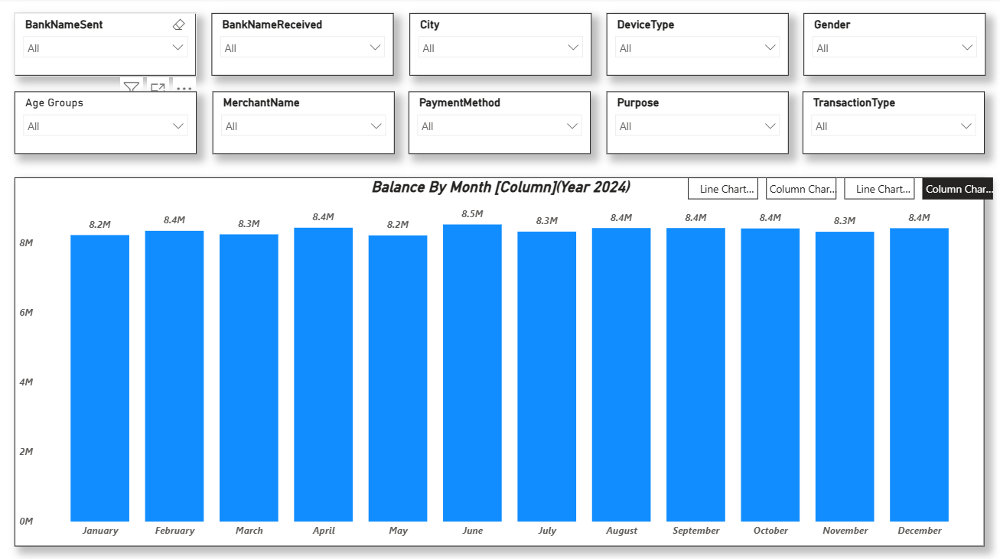
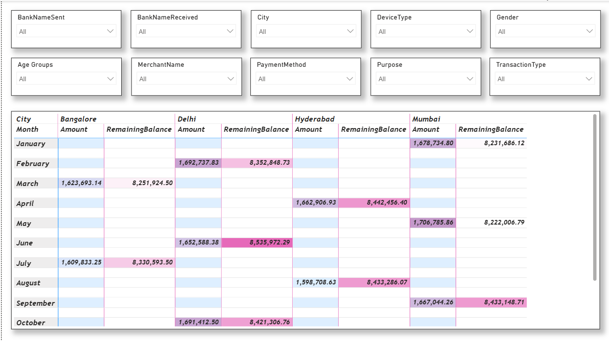

# 📊 UPI Transaction Analytics Dashboard | Power BI

An interactive **Power BI dashboard** developed to analyze UPI (Unified Payments Interface) transaction data. This project provides insights into transaction trends, remaining balances, payment behavior, and city-wise financial analysis through dynamic visualizations and interactive filters.

---

## 📌 Project Overview

The **UPI Transaction Analytics Dashboard** transforms raw transaction data into actionable business insights using Power BI. It enables users to monitor monthly balance trends, analyze transaction activity across cities, and explore payment data using interactive slicers.

This project demonstrates practical skills in **data visualization, dashboard development, data modeling, and business intelligence reporting**.

---

## 🎯 Business Objectives

- Analyze monthly remaining balance trends.
- Compare transaction amounts across different cities.
- Enable interactive filtering by bank, payment method, merchant, gender, device type, and transaction type.
- Provide detailed transaction summaries for better financial analysis.
- Support data-driven decision-making through interactive reporting.

---

# 🛠️ Tools & Technologies

- **Microsoft Power BI**
- **Power Query**
- **DAX (Data Analysis Expressions)**
- **Microsoft Excel**
- **Data Modeling**
- **Data Visualization**

---

# 📂 Dataset

The dashboard is built using UPI transaction data containing information such as:

- Transaction Date
- Bank Name (Sender & Receiver)
- Transaction Amount
- Remaining Balance
- City
- Merchant Name
- Payment Method
- Transaction Type
- Device Type
- Gender
- Purpose
- Age Group

---

# 📊 Dashboard Pages

## 📈 Page 1 – Balance Trend Analysis

Features:

- Monthly Remaining Balance Analysis
- Dynamic Chart Selection
- Interactive Slicers
- Bank-wise Filtering
- Merchant-wise Analysis
- Payment Method Filtering
- Device Type Analysis
- Transaction Type Filtering

---

## 📈 Page 2 – City-wise Transaction Analysis

Features:

- City-wise Transaction Matrix
- Monthly Transaction Summary
- Remaining Balance Comparison
- Transaction Amount Analysis
- Interactive Drill-down

---

# 📈 Key Insights

- Compare monthly remaining balances across the year.
- Analyze transaction amounts by city.
- Filter transaction data using multiple business dimensions.
- Explore payment behavior through interactive dashboard controls.
- Identify transaction trends using dynamic visualizations.

---

# 💼 Skills Demonstrated

- Data Cleaning
- Data Transformation
- Power Query
- DAX Calculations
- Data Modeling
- Interactive Dashboard Development
- Financial Data Analysis
- Business Intelligence
- KPI Reporting
- Data Visualization
- Analytical Thinking

---

# 📷 Dashboard Preview

## Balance Trend Analysis



---

## City-wise Transaction Analysis



---

# 📁 Repository Structure

```text
upi-transaction-analytics-dashboard/
│
├── UPI_Transaction_Analytics_Dashboard.pbix
├── UPI_Transactions_Data.xlsx
├── Screenshots/
│   ├── Page1_Balance_Trend_Analysis.png
│   └── Page2_Citywise_Transaction_Analysis.png
└── README.md
```

---

# 🚀 Getting Started

## Clone the Repository

```bash
git clone https://github.com/satyam-katara/upi-transaction-analytics-dashboard.git
```

## Open the Dashboard

Open the following file using **Microsoft Power BI Desktop**:

```
UPI_Transaction_Analytics_Dashboard.pbix
```

---

# 📈 Business Value

This dashboard enables users to:

- Monitor monthly balance trends.
- Analyze city-wise transaction performance.
- Explore payment behavior using interactive filters.
- Compare transaction amounts across multiple dimensions.
- Improve financial reporting through visual analytics.

---

# 🔮 Future Enhancements

- SQL Server Integration
- Real-Time Data Refresh
- Interactive KPI Cards
- Fraud Detection Dashboard
- Transaction Volume Forecasting
- Advanced Financial Analytics

---

# 🌟 Project Highlights

- Interactive Power BI Dashboard
- UPI Transaction Analytics
- Financial Data Analysis
- Dynamic Filtering
- Business Intelligence Reporting
- Data Visualization
- Portfolio-Ready Analytics Project

---

# 👨‍💻 Author

**Satyam Katara**

Aspiring Data Analyst | Power BI | SQL | Python | Excel

### Connect with Me

- **GitHub:** https://github.com/satyam-katara

---

## ⭐ If you found this project useful, consider giving it a Star!

---

# 📄 License

This project is created for educational, learning, and portfolio purposes.
